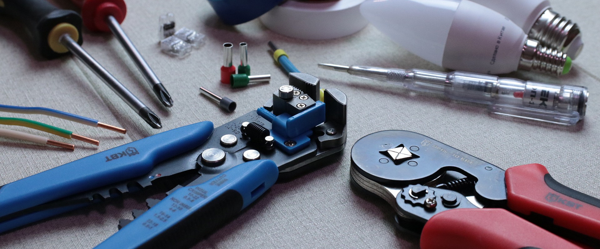
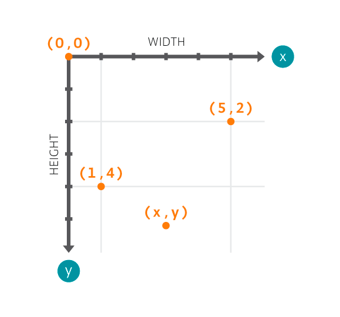
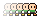
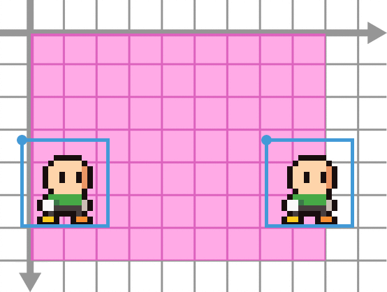
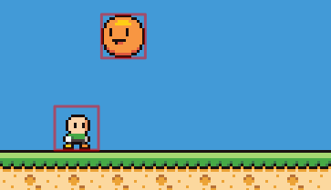
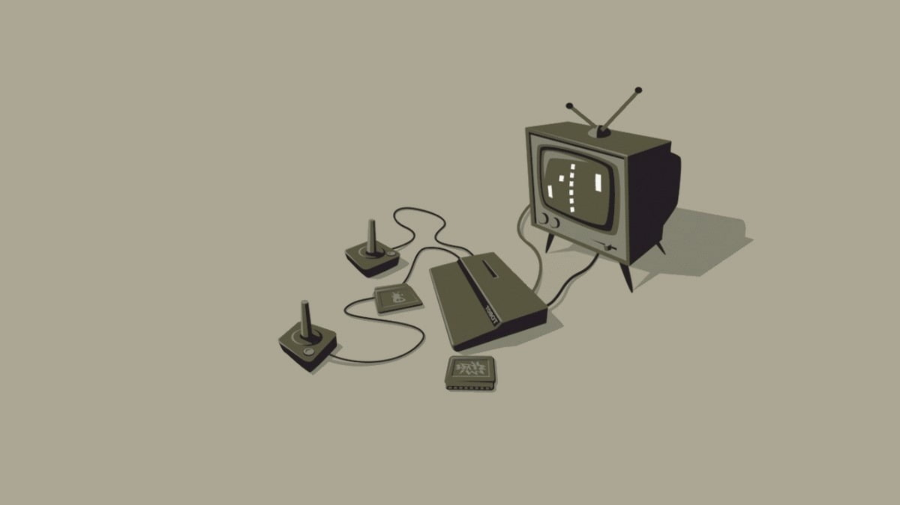

class: center, middle, inverse, layout

# Cómo crear un videojuego: 
## lleva tu idea desde tu cabeza al joystick

Pablo Abratte

<small style="font-size: 14px;">pablo.abratte@smartfense.com<small>

---

class: inverse
layout: true

---
 
# ¿Qué vamos a utilizar?

.right-column50[.center[]]

.left-column50[
* Motor de videojuegos: [Haxeflixel](https://haxeflixel.com/)
* Lenguaje de programación: [Haxe](https://haxe.org/)
* Editor/IDE: [VSCode](https://code.visualstudio.com)
]

---

background-image: url(img/question-mark-1872634_1920.jpg)

# ¿Por qué Haxeflixel?

* **Fácil y rápido** para prototipar juegos casual y arcade
* **2D**
* **Multiplataforma** nativo (desktop, mobile, browser)

---

# ¿Cómo instalar?

.center[[https://haxeflixel.com/documentation/getting-started/](https://haxeflixel.com/documentation/getting-started/)]



---


# La idea del juego: ¿Qué es un juego?

.center[
##4 Rasgos definen un juego
]

.left-column50[
* Meta
* Reglas
* Feedback
* Participación voluntaria
]

.right-column50[

]

<div style="clear: both; padding: 30px; border: 1px solid gray; border-radius: 5px;">
<cite style="font-size: 18px; font-family: serif;">
"Jugar un juego supone un intento voluntario de superar obstáculos innecesarios"
<div style="text-align: right; font-size: 14px;">Jane McGonigal - Reality is Broken, 2011<div>
</cite>
<div>
---

# La idea para nuestro juego


.center[El héroe se mueve por la pantalla esquivando enemigos durante la mayor cantidad de tiempo posible]


---

class: center, middle, inverse

# ¡Manos a la obra!

---


# Estructura de un proyecto
.center[

]

* en **assets**: se guardan recursos (imágenes, sonidos, etc)
* en **source**: está el código fuente
* en **export**: se generan los ejecutables
---


# Estructura de una escena

Empezamos creando una escena/estado: **PlayState**

```haxe
import flixel.FlxState;

// crear una escena heredando de FlxState
class PlayState extends FlxState{
        // declarar los actores

        override public function create():Void{
                super.create();
                // inicializar
        }

        override public function update(elapsed:Float):Void{
                super.update(elapsed);
                // actualizar
        }
}
```

* Se debe heredar (extends) de la clase **FlxState**
* Redefinir el método *create()* (inicialización)
* Redefinir el método *update()* (actualización)

---

# Agregando un sprite

```haxe
import flixel.FlxState;

// crear una escena heredando de FlxState
class PlayState extends FlxState{
        var personaje: FlxSprite;

        override public function create():Void{
                super.create();
                personaje = new FlxSprite(10, 10, "assets/images/char_wbg.png")
                add(personaje)
        }

        override public function update(elapsed:Float):Void{
                super.update(elapsed);
        }
}
```
* Declarar una variable de tipo **FlxSprite** (una imagen que se puede mover)
* Inicializarla con **new** (pasar los parámetros al constructor)
* Agregarla a la escena con *add()*

---
class: center
# El sistema de coordenadas de la pantalla



La posición que especificamos para un sprite corresponde a **la esquina superior izquierda** del mismo

---

# Dando vida a nuestro héroe

.center[]

```haxe
personaje.velocity.x = 100;
personaje.velocity.y = -20;
personaje.velocity.set(12, 45);
```

Al ajustar el atributo *velocity* el héroe se moverá sólo *siempre y cuando haya sido agregado a la escena*

---


# Ready Player 1

.center[]

```haxe
if(FlxG.keys.pressed.A){ // la tecla 'A' se encuentra presionada?
        personaje.velocity.x = 100;
}else if(FlxG.keys.pressed.D){
        personaje.velocity.x = -100;
}else{
        personaje.velocity.x = 0;
}
```

**FlxG** nos permite acceder a los diferentes sistemas del motor de juegos, por ejemplo, la entrada por teclado

---


# Evitando salir de la pantalla

.center[]

```haxe
if(personaje.x < 0){                 // borde izq
        personaje.x = 0;             // corregir pos
        personaje.velocity.x = 0;    // anular velocidad
}

if(personaje.x > FlxG.width - personaje.width){           // borde der
        personaje.x = FlxG.width - personaje.width;       // corregir pos
        personaje.velocity.x = 0;                    // anular velocidad
}
```

Es necesario tener en cuenta que la posición corresponde al vértice superior izquierdo y el ancho del sprite

---

# Refactoring 

Movemos al personaje a su propia clase.

```haxe
class PlayState extends FlxState{
        var personaje: Personaje;
	
        override public function create():Void{
		super.create();
		personaje = new Personaje(152, 152);
		add(personaje);
	}

	override public function update(elapsed:Float):Void{
		super.update(elapsed);
	}
}
```

Notar que la variable ya no es de tipo **FlxSprite**, y la cantidad de código es mucho menor.

---


# Refactoring 

```haxe
class Personaje extends FlxSprite{
        public function new(X: Float, Y: Float){
                super(X, Y, "assets/images/char.png");
        }

        public override function update(elapsed: Float):Void{
                super.update(elapsed);
                if(FlxG.keys.pressed.A){
                        velocity.x = -100;
                }else if(FlxG.keys.pressed.D){
                        velocity.x = 100;
                }else{
                        velocity.x = 0;
                }
                ...
        }
}
```

Notar que ya no es necesario indicar que el atributo *velocity* corresponde al personaje, porque estamos **dentro** del personaje.

---

# Refactoring ¿Por qué? 

.center[]


* Cada entidad del juego se encarga de especificar **su propio comportamiento**
* Es **fácil agregar muchas instancias** de una misma entidad (por ej: los enemigos)
* La escena se encarga sólo de las interacciones entre entidades y aplicar las reglas del juego

---

# ¡Cuidado! Ha aparecido un enemigo

.center[]

* El enemigo se mueve por la pantalla
* Lógica similar al personaje (no requiere input)
* Rebota (invierte su velocidad) en los bordes

---

# ¿Cómo detectar cuando dos cosas chocan?

Haxeflixel utiliza Axis Aligned Bounding Boxes (AABB)

.center[]

```haxe
override public function update(elapsed:Float):Void{
        super.update(elapsed);
        FlxG.overlap(personaje, pelota, personajeChocaPelota);
}

private function personajeChocaPelota(personaje: Personaje, pelota: Pelota){
        personaje.kill();
}
```

* Se debe comprobar colisiones **en cada actualización**
* La función callback recibe como argumentos los actores que colisionaron
* *kill()* elimina a un actor de la escena
---

# Puntos

* Contabilizamos el tiempo acumulando lo transcurrido desde el cuadro anterior
* El texto se puede representar con **FlxText**, funciona de manera similar a un **FlxSprite**

```haxe
// actualizar puntaje
if(personaje.alive){
        puntaje = puntaje + elapsed;
}

// actualizar texto con el puntaje
texto_puntaje.text = "Puntaje: "+Std.int(puntaje);
```

---

# Muchos enemigos
.left-column50[

```haxe
override public function create():Void{
        super.create();
        pelotas = new FlxGroup();
        add(pelotas);
}
```
]

.center[
.right-column50[

]
]

.clear[
* Crear un **FlxGroup** (son entidades que contienen otras entidades, como la escena)
* Agregar cada enemigo al grupo
* Agregar el grupo a la escena (todas las entidades del grupo se agregan automáticamente)
* *overlap()* funciona con grupos! El callback se invoca una vez por cada colisión y recibe como argumento el objeto que colisionó (no el grupo)
]

---

# Muchos enemigos

```haxe
override public function update(elapsed:Float):Void{
        // agrega una nueva pelota cada 3 segundos
        tiempoNuevaPelota = tiempoNuevaPelota + elapsed;
        if(tiempoNuevaPelota >= 3){
                agregarPelota();
                tiempoNuevaPelota = 0;
        }
}

private function agregarPelota(){
        var p = new Pelota();
        pelotas.add(p);
}
```
El tiempo para cada nueva pelota se puede contabilizar de manera similar al puntaje

---

class: center, middle
# Y más!

<a href="/demo/index.html" target="_blank">Demo</a>

---

background-color: #aca794
# ¡Muchas gracias!


