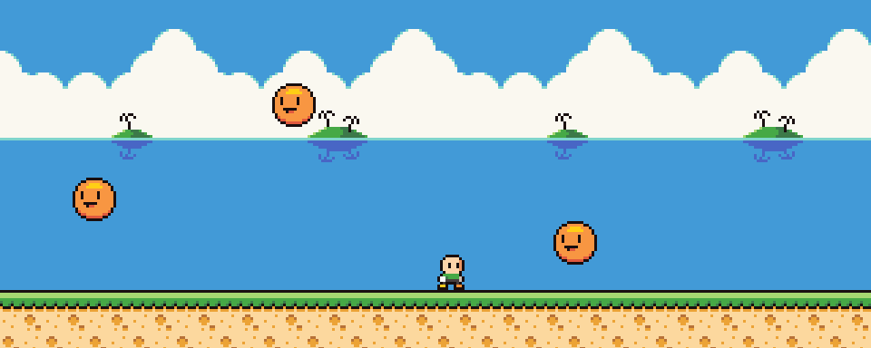

class: center, middle, inverse, layout

# Cómo crear un videojuego: 
## lleva tu idea desde tu cabeza al joystick

Pablo Abratte

<small>pablo.abratte@smartfense.com<small>

---

class: inverse
layout: true

---
 
# ¿Qué vamos a utilizar?

* Motor de videojuegos: [Haxeflixel](https://haxeflixel.com/)
* Lenguaje de programación: [Haxe](https://haxe.org/)
* Editor/IDE: [VSCode](https://code.visualstudio.com)

---

# ¿Por qué Haxeflixel?

* Fácil y rápido para prototipar juegos casual y arcade
* 2D
* Multiplataforma nativo (desktop, mobile, browser)

???
poner imagen
---

# ¿Cómo instalar?

[https://haxeflixel.com/documentation/getting-started/](https://haxeflixel.com/documentation/getting-started/)

???
poner imagen
---


# La idea del juego: ¿Qué es un juego?

## 4 Rasgos definen un juego

* Meta
* Reglas
* Feedback
* Participación voluntaria

.center[
<cite style="font-size: 18px;">
Jugar un juego supone un intento voluntario de superar obstáculos innecesarios
Jane McGonigal - Reality is Broken, 2011
</cite>]
---

# La idea para nuestro juego



.center[El héroe se mueve por la pantalla esquivando enemigos durante la mayor cantidad de tiempo posible]


---

class: center, middle, inverse

# ¡Manos a la obra!

---


# Estructura de un proyecto


---


# Estructura de una escena

```haxe
import flixel.FlxState;

// crear una escena heredando de FlxState
class PlayState extends FlxState{
        // declarar los actores

        override public function create():Void{
                super.create();
                // inicializar
        }

        override public function update(elapsed:Float):Void{
                super.update(elapsed);
                // actualizar
        }
}
```

---

# Agregando un sprite

```haxe
import flixel.FlxState;

// crear una escena heredando de FlxState
class PlayState extends FlxState{
        var hero: FlxSprite;

        override public function create():Void{
                super.create();
                hero = new FlxSprite(10, 10, "assets/images/char_wbg.png")
                add(hero)
        }

        override public function update(elapsed:Float):Void{
                super.update(elapsed);
        }
}
```

---

# El sistema de coordenadas de la pantalla

asdas

---

# Dando vida a nuestro héroe

Movimiento...

---